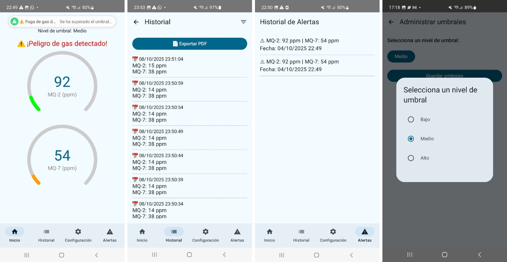
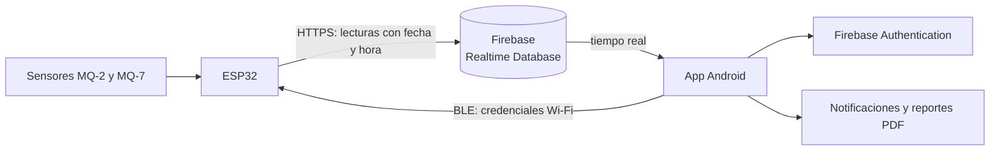
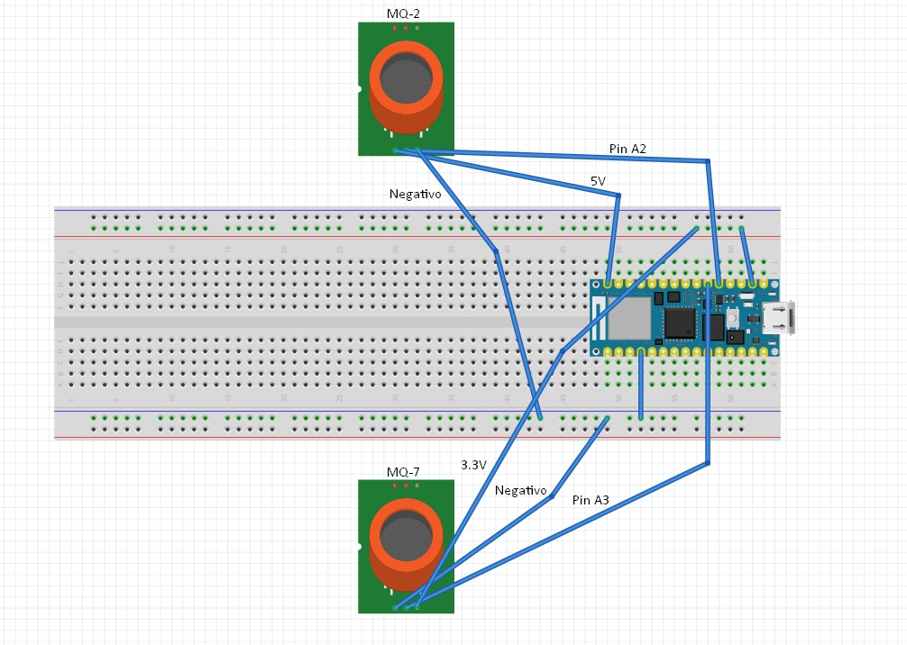

# GasLeak — Sistema de detección de fugas de gas

Proyecto de título de Ingeniería Civil Informática (Universidad Andrés Bello, 2025). Es un prototipo IoT que mide gases con un ESP32 y sensores MQ, y avisa en tiempo real desde una aplicación Android.

Este repositorio contiene la **aplicación Android**. El firmware del ESP32 se documenta aquí a nivel de arquitectura.

*Monitoreo en tiempo real con alerta, historial de lecturas, historial de alertas y configuración de umbrales.*

## Qué hace

- **Monitoreo en tiempo real** de dos sensores: MQ-2 (gas licuado y humo) y MQ-7 (monóxido de carbono), mostrados en indicadores de tipo gauge.
- **Alertas** con notificación del sistema cuando una lectura supera el umbral configurado.
- **Umbrales configurables** (bajo, medio y alto) por usuario.
- **Historial** de lecturas y de alertas, con exportación a PDF.
- **Configuración del dispositivo por Bluetooth (BLE):** la app envía al ESP32 las credenciales de la red Wi-Fi sin necesidad de reprogramarlo.
- **Cuentas de usuario** con registro, inicio de sesión y recuperación de contraseña.

## Arquitectura

- **ESP32:** lee los sensores, sincroniza la hora por NTP, guarda la configuración en memoria no volátil y envía las lecturas a Firebase por HTTPS.
- **App Android:** escucha los cambios de la base en tiempo real, evalúa los umbrales y notifica al usuario.

## Stack

| Componente | Tecnología |
|---|---|
| App móvil | Kotlin, Jetpack Compose, Navigation Compose (Android 8.0+) |
| Backend | Firebase Authentication y Realtime Database |
| Hardware | ESP32, sensores MQ-2 y MQ-7 |
| Firmware | C++ (Arduino): Wi-Fi, BLE, HTTPClient, NTP |

## Ejecutar la app

1. Clonar el repositorio y abrirlo en Android Studio.
2. Crear un proyecto propio en Firebase, habilitar Authentication (correo y contraseña) y Realtime Database, registrar una app Android con el paquete `com.example.detector` y guardar su `google-services.json` en `app/`. El archivo no se versiona; `app/google-services.example.json` muestra la estructura esperada.
3. Compilar y ejecutar en un dispositivo con Android 8.0 o superior. La configuración BLE requiere un dispositivo físico.

## Estado

Prototipo académico terminado y presentado como proyecto de título en 2025. No es un producto certificado de seguridad y no reemplaza a un detector de gas homologado.

## Autor

Tomás Martínez Schipmann — [LinkedIn](https://www.linkedin.com/in/tomasmsch/)
